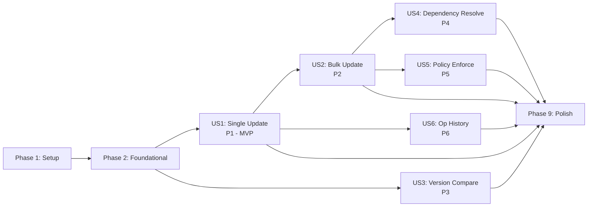

# Tasks: Install Orchestration Engine

**Input**: Design documents from `specs/012-install-orchestration/`
**Prerequisites**: plan.md, spec.md, research.md, data-model.md, contracts/engine-service.rs

## Format: `[ID] [P?] [Story] Description`

- **[P]**: Can run in parallel (different files, no dependencies)
- **[Story]**: Which user story this task belongs to (e.g., US1, US2)
- Exact file paths included in descriptions

## Phase 1: Setup

**Purpose**: Rebase onto main, add dependencies, create engine module structure

- [ ] T001 Rebase `012-install-orchestration` onto `main` to pick up specs 004–013 implementation code
- [ ] T002 Add `regex = "1"` and `fd-lock = "4"` to `crates/astro-up-core/Cargo.toml` dependencies; add `sysinfo` (already workspace dep from spec 005) if not present
- [ ] T003 Create engine module structure: `crates/astro-up-core/src/engine/mod.rs` with submodule declarations (orchestrator, planner, version_cmp, policy, history, lock, process); register `pub mod engine` in `crates/astro-up-core/src/lib.rs`

---

## Phase 2: Foundational

**Purpose**: Core types and infrastructure that ALL user stories depend on

**CRITICAL**: No user story work can begin until this phase is complete

- [ ] T004 [P] Implement `VersionFormat` enum (Semver, Date, Custom(String)) with serde and Display in `crates/astro-up-core/src/engine/version_cmp.rs`; implement `compare_versions(a: &str, b: &str, format: &VersionFormat) -> Ordering` with semver dispatch (existing `try_parse_lenient`); date and custom branches return stub `Ordering::Equal` (full implementations in T024/T025)
- [ ] T005 Implement `PackageStatus` enum (UpToDate, UpdateAvailable, MajorUpgradeAvailable, NewerThanCatalog, NotInstalled, Unknown) with `determine(installed: &Version, catalog: &Version, format: &VersionFormat) -> PackageStatus` in `crates/astro-up-core/src/engine/version_cmp.rs`; basic logic only — all non-equal comparisons return `UpdateAvailable` (major/minor distinction added in T027); include `is_major_upgrade(from, to) -> bool` stub returning false (depends on T004)
- [ ] T006 [P] Implement `UpdatePlan`, `PlannedUpdate`, `SkippedPackage`, `SkipReason` structs in `crates/astro-up-core/src/engine/planner.rs` per data-model.md
- [ ] T007 [P] Implement global lock file in `crates/astro-up-core/src/engine/lock.rs`: `OrchestrationLock` struct wrapping `fd_lock::RwLock<File>`, write PID on acquire, stale lock detection via `sysinfo` process check, `acquire() -> Result<Self>` and auto-release on Drop
- [ ] T008 [P] Implement running-process detection in `crates/astro-up-core/src/engine/process.rs`: `check_process_running(process_name: &str) -> Option<ProcessInfo>` using `sysinfo::System::processes_by_name()` with case-insensitive matching; `ProcessInfo` struct with `name`, `pid`, `exe_path`
- [ ] T009 [P] Add orchestration-level events to `crates/astro-up-core/src/events.rs`: `PlanReady`, `PackageStarted`, `PackageComplete`, `PackageSkipped`, `ProcessBlocking`, `OrchestrationComplete` per data-model.md
- [ ] T010 [P] Add `OperationType` (Install, Update, Uninstall), `OperationStatus` (Success, Failed, Cancelled, RebootPending), and `OperationRecord` struct to `crates/astro-up-core/src/engine/history.rs` per data-model.md
- [ ] T011 Unit tests for `VersionFormat` comparisons in `crates/astro-up-core/tests/version_formats.rs`: semver strict + lenient, date (YYYY.MM.DD and YYYY-MM-DD), custom regex, 4-part coercion, `is_major_upgrade`, `PackageStatus::determine` for each variant

**Checkpoint**: Foundation ready — all core types, lock, process detection, and events in place

---

## Phase 3: User Story 1 — Update a Single Package (Priority: P1) MVP

**Goal**: `astro-up update nina` orchestrates compare → download → backup → install → verify with events

**Independent Test**: Mock all trait impls (Detector, Downloader, Installer, BackupManager), run single-package pipeline, verify step order and events

- [ ] T012 [US1] Define `UpdateRequest` struct and `Orchestrator` trait in `crates/astro-up-core/src/engine/orchestrator.rs` per contracts/engine-service.rs: `plan()`, `execute()`, `history()` methods
- [ ] T013 [US1] Implement `UpdateOrchestrator` struct in `crates/astro-up-core/src/engine/orchestrator.rs`: constructor taking trait objects (catalog reader, detector, downloader, installer, backup manager, db connection), stores `OrchestrationLock` guard
- [ ] T014 [US1] Implement single-package pipeline in `UpdateOrchestrator::execute_single()` private method: compare (detect installed vs catalog) → check process not running (FR-018, block with `ProcessBlocking` event) → check disk space via `sysinfo::Disks` against expected installer size, abort if insufficient (FR-011) → download → backup (if `has_backup_config`) → install → verify (re-detect, FR-009); emit `PipelineEvent` at each step via callback
- [ ] T015 [US1] Implement cancellation support in pipeline: check `CancellationToken::is_cancelled()` between each step; on cancel, log status as Cancelled, emit event, break
- [ ] T016 [US1] Implement `execute()` for single-package case in orchestrator: acquire lock → build single-item plan → run `execute_single()` → release lock; on install/verify failure, log backup path per FR-019
- [ ] T017 [US1] Integration test in `crates/astro-up-core/tests/engine_orchestrator.rs`: mock Detector/Downloader/Installer/BackupManager, run single-package update, assert step order via collected events; test process-blocking scenario; test cancellation mid-pipeline; test failure-after-backup logs backup path

**Checkpoint**: Single-package update end-to-end functional. MVP complete.

---

## Phase 4: User Story 2 — Update All Packages (Priority: P2)

**Goal**: `astro-up update --all` updates all packages respecting dependency order, continuing on independent failures

**Independent Test**: Plan 5 packages (2 with dependencies), fail one, verify dependents skipped and independents continue

- [ ] T018 [US2] Implement `UpdatePlanner::plan_all()` in `crates/astro-up-core/src/engine/planner.rs`: query catalog for all packages, detect installed versions, compare using `PackageStatus::determine`, collect `PlannedUpdate` items and `SkippedPackage` items (up-to-date, newer-than-catalog)
- [ ] T019 [US2] Implement topological sort (Kahn's algorithm) in `crates/astro-up-core/src/engine/planner.rs`: `fn topological_sort(updates: &[PlannedUpdate]) -> Result<Vec<PlannedUpdate>, CoreError>` using `DependencyConfig.requires` from `Software`; detect cycles and return `CoreError::DependencyCycle { path }` (add variant to error.rs)
- [ ] T020 [US2] Implement `UpdatePlanner::plan_specific()` for named packages: same as `plan_all` but filtered to requested package IDs; resolve transitive dependencies and include them
- [ ] T021 [US2] Implement continue-on-error in `UpdateOrchestrator::execute()` for multi-package plans: iterate topo-sorted plan, on failure mark dependents as `SkipReason::DependencyFailed`, continue with independent packages per FR-007/FR-008; emit `PackageSkipped` events
- [ ] T022 [US2] Implement `--dry-run` support: when `UpdateRequest.dry_run` is true, return the `UpdatePlan` without executing; emit `PlanReady` event with total/skipped counts per FR-004
- [ ] T023 [US2] Integration test in `crates/astro-up-core/tests/engine_planner.rs`: 5 packages with 2 dependencies, verify topo order; test cycle detection; test continue-on-error (fail one, verify dependents skipped); test dry-run returns plan without side effects

**Checkpoint**: Bulk update with dependency ordering and failure handling working

---

## Phase 5: User Story 3 — Version Comparison (Priority: P3)

**Goal**: Format-aware version comparison across semver, date, and custom regex formats

**Independent Test**: Compare versions in each format, verify correct ordering and status

- [ ] T024 [US3] Implement date version parsing in `crates/astro-up-core/src/engine/version_cmp.rs`: `parse_date(raw: &str) -> Option<NaiveDate>` supporting both `YYYY.MM.DD` and `YYYY-MM-DD` separators; handle edge cases (trailing text, leading zeros)
- [ ] T025 [US3] Implement custom regex version parsing in `crates/astro-up-core/src/engine/version_cmp.rs`: `parse_custom(raw: &str, regex: &Regex) -> Option<Vec<u64>>` extracting capture groups as numeric components; cache compiled `Regex` per format string
- [ ] T026 [US3] Implement format mismatch fallback: when catalog says semver but detection returns non-semver string (or vice versa), fall back to raw string comparison with a warning event per edge case spec
- [ ] T027 [US3] Implement `MajorUpgradeAvailable` detection in `PackageStatus::determine`: for semver packages, distinguish minor (UpdateAvailable) from major (MajorUpgradeAvailable) using `is_major_upgrade`; for non-semver, always return `UpdateAvailable` per clarification (semver-only major/minor distinction)
- [ ] T028 [US3] Snapshot tests in `crates/astro-up-core/tests/version_formats.rs`: insta snapshots for version comparison results across all format combinations; edge cases: `v3.1` vs `3.1.0`, `2026.03.29` vs `2026-03-29`, `3.1 HF2` vs `3.1 HF3`, 4-part coercion, newer-than-catalog, format mismatch fallback

**Checkpoint**: All version formats compared correctly with proper PackageStatus

---

## Phase 6: User Story 4 — Dependency Resolution (Priority: P4)

**Goal**: Detect and resolve package dependencies, install prerequisites first

**Independent Test**: Package with unmet dependency triggers prerequisite install offer

- [ ] T029 [US4] Extend `UpdatePlanner` with dependency satisfaction check in `crates/astro-up-core/src/engine/planner.rs`: for each planned update, check `DependencyConfig.requires` against detected versions; unmet deps that ARE in the catalog → add to plan (before dependent); unmet deps NOT in catalog → `CoreError::MissingDependency`
- [ ] T030 [US4] Implement cycle detection reporting in `crates/astro-up-core/src/engine/planner.rs`: on `DependencyCycle` error, include the full cycle path (A → B → C → A) in the error message for user display
- [ ] T031 [US4] Integration test for dependency resolution in `crates/astro-up-core/tests/engine_planner.rs`: package A requires B (not installed) → plan includes B before A; package with met dependency → proceeds directly; circular A→B→A → error with cycle path

**Checkpoint**: Dependencies auto-resolved and installed in correct order

---

## Phase 7: User Story 5 — Update Policy Enforcement (Priority: P5)

**Goal**: Enforce per-package and global update policies (minor-only, allow-major, manual, none)

**Independent Test**: Configure "minor only", verify major updates skipped for semver packages and all updates proceed for date/custom

- [ ] T032 [US5] Implement policy enforcement in `crates/astro-up-core/src/engine/policy.rs`: `fn apply_policy(status: &PackageStatus, policy: &PolicyLevel, allow_major: bool, format: &VersionFormat) -> Option<SkipReason>` — returns None if update allowed, Some(SkipReason) if blocked; semver-only major/minor filtering per clarification
- [ ] T033 [US5] Integrate policy into `UpdatePlanner`: load `UpdatePolicy` from config, apply `apply_policy()` to each package during plan building; `--allow-major` overrides `PolicyLevel::Minor` for the current invocation per FR-005; per-package overrides from `UpdatePolicy.per_package` per FR-003
- [ ] T034 [US5] Implement `--allow-downgrade` gate in planner: add `allow_downgrade: bool` field to `UpdateRequest`, when installed > catalog (NewerThanCatalog) reject unless flag is set per FR-012; add `SkipReason::DowngradeBlocked`; wire flag through orchestrator → planner
- [ ] T035 [US5] Unit tests for policy enforcement in `crates/astro-up-core/tests/engine_policy.rs`: minor-only blocks major semver; minor-only allows date/custom; `--allow-major` overrides; per-package override; Manual policy blocks unless explicit; None policy blocks all; downgrade blocked/allowed

**Checkpoint**: Policies enforced correctly, date/custom bypass major filtering

---

## Phase 8: User Story 6 — Operation History (Priority: P6)

**Goal**: Log every operation to SQLite with queryable history

**Independent Test**: Run an update, query history, verify record fields

- [ ] T036 [US6] Implement SQLite operations table in `crates/astro-up-core/src/engine/history.rs`: `create_table(conn: &Connection)` with schema from research.md (id, package_id, operation_type, from_version, to_version, status, duration_ms, error_message, created_at); indexes on package_id and created_at
- [ ] T037 [US6] Implement `record_operation(conn, record: &OperationRecord) -> Result<i64>` and `query_history(conn, filter: &HistoryFilter) -> Result<Vec<OperationRecord>>` in `crates/astro-up-core/src/engine/history.rs`
- [ ] T038 [US6] Integrate history recording into `UpdateOrchestrator::execute_single()`: start timer before pipeline, record OperationRecord on completion (success, failed, cancelled) with duration and optional error message
- [ ] T039 [US6] Implement `Orchestrator::history()` method delegating to `query_history()` with `HistoryFilter` support (by package, by type, with limit)
- [ ] T040 [US6] Integration test for history in `crates/astro-up-core/tests/engine_orchestrator.rs`: run successful update → verify history record; run failed update → verify error in record; run cancelled update → verify cancelled status; query by package filter

**Checkpoint**: All operations logged, queryable by package and type

---

## Phase 9: Polish & Cross-Cutting Concerns

**Purpose**: Remaining FRs, hardening, documentation

- [ ] T041 [P] Add tracing instrumentation to all public engine methods: `#[tracing::instrument]` on `plan()`, `execute()`, `history()`, and key private methods per constitution (Principle III testing, observability)
- [ ] T042 Run `cargo fmt --all` and `cargo clippy --all-targets -- -D warnings` — fix any issues
- [ ] T043 Run `cargo test -p astro-up-core` — verify all existing + new tests pass
- [ ] T044 Validate against quickstart.md: verify engine module structure matches, test commands work, dependency list accurate

---

## Dependencies & Execution Order

### Phase Dependencies

- **Setup (Phase 1)**: No dependencies — start immediately
- **Foundational (Phase 2)**: Depends on Phase 1 (T001–T003)
- **US1 (Phase 3)**: Depends on Phase 2 — **MVP target**
- **US2 (Phase 4)**: Depends on Phase 3 (US1 pipeline)
- **US3 (Phase 5)**: Depends on Phase 2 only (version comparison is standalone)
- **US4 (Phase 6)**: Depends on Phase 4 (extends planner)
- **US5 (Phase 7)**: Depends on Phase 4 (integrates into planner)
- **US6 (Phase 8)**: Depends on Phase 3 (integrates into orchestrator)
- **Polish (Phase 9)**: Depends on all user stories

### User Story Dependencies



### Parallel Opportunities

**Within Phase 2**: T004–T010 are ALL parallel (different files)

**After Phase 2**: US1 and US3 can run in parallel (US3 is version comparison only, US1 is the pipeline)

**After US1**: US2 and US6 can run in parallel (US2 extends planner, US6 extends orchestrator — different files)

**After US2**: US4 and US5 can run in parallel (both extend planner but different functions)

---

## Parallel Example: Phase 2 (Foundational)

```
# All foundational tasks in parallel (7 different files):
T004: VersionFormat + compare_versions in engine/version_cmp.rs
T005: PackageStatus in engine/version_cmp.rs  ← WAIT: same file as T004
T006: UpdatePlan types in engine/planner.rs
T007: OrchestrationLock in engine/lock.rs
T008: Process detection in engine/process.rs
T009: Events in events.rs
T010: OperationRecord in engine/history.rs

# Actual parallel groups:
Group A: T004+T005 (same file, sequential)
Group B: T006
Group C: T007
Group D: T008
Group E: T009
Group F: T010
Then: T011 (tests, depends on T004+T005)
```

---

## Implementation Strategy

### MVP First (US1 Only)

1. Phase 1: Setup (T001–T003)
2. Phase 2: Foundational (T004–T011)
3. Phase 3: US1 Single Package Update (T012–T017)
4. **STOP and VALIDATE**: single-package update works end-to-end
5. Checkpoint commit

### Incremental Delivery

1. Setup + Foundational → Core types and infrastructure ready
2. US1 → Single package update works → **MVP**
3. US3 → Version formats fully tested → Confidence in comparison logic
4. US2 → Bulk update with dependencies → Main value add
5. US4 + US5 → Dependency resolution + policies → Full orchestration
6. US6 → Operation history → Diagnostics ready
7. Polish → Disk space, tracing, clippy → Production ready

---

## Notes

- Branch needs rebase onto main before implementation (T001) — catalog, detection, download, install, backup modules are on main but not on this branch
- `sysinfo` is already a dependency from spec 005 — used for both process detection and stale lock recovery
- Spec 005's catalog lockfile code (`catalog/lockfile.rs`) provides a reusable PID-based locking pattern for T007
- The `Orchestrator` trait (contracts/engine-service.rs) is the public API — CLI and GUI both consume it
- Constitution check passed — no violations, no complexity tracking needed
